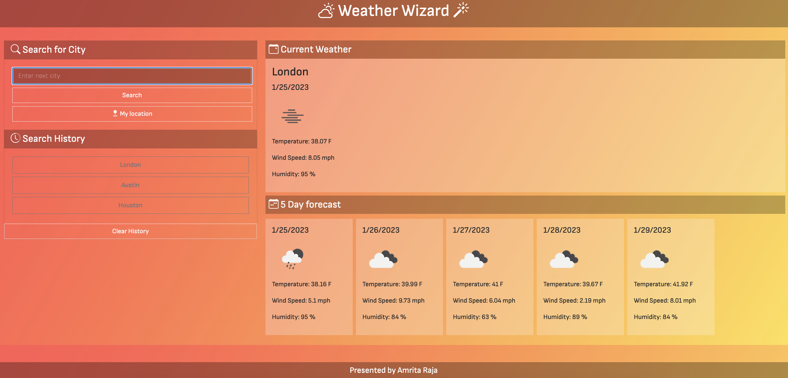

# Weather Wizard

By Amrita Raja

## What is it?
Weather dashboard that displays the weather for multiple cities. Displays the current weather as well as the 5 day forecast. 

## What's created?
- Search tool that connects to open weather API and pulls in current and future condition weather data.
- When searching for the weather - it displays the cities name, date, icon representation of weather condition, temperature, humidity, and wind speed.
- Searches also displays in a search history list that can be used to navigate to a past search.
- Created a clear button that can erase the weather history list.

## BONUS
- Limited search results to only show the top 6 results in most recent searches, old searches are no longer to display to keep the website minimal and continuous access to the clean button.
- Added function to pull users geo location of city to automatically populate weather results when opening page.
- Added a easy access location button to load weather results for users current location. 

## Why is this useful?
Continues to challenge skills in HTML, javascript, css as well as introduces new skills of intergrated third party API.

## Github link
Repo link: https://github.com/Amritaraja/Weather-Wizard.git

Page link: https://amritaraja.github.io/Weather-Wizard/

